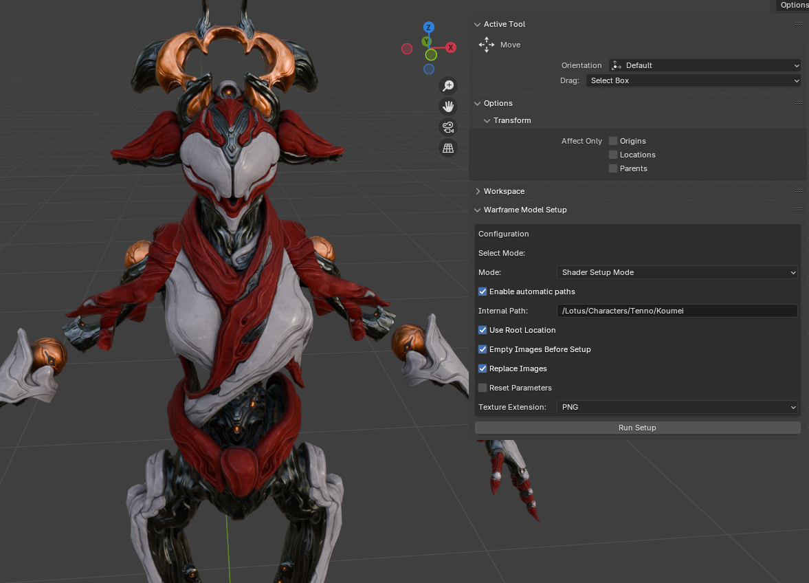

## Auto Porter Blender Addon

A Blender addon that simplifies some of the tedium and repetitive manual setup when porting assets.  
Tested on Blender 4.1—4.4.

### Installation
1. Download the [latest release](https://github.com/BellSharions/Warframe-Auto-Porter-Addon/releases).
2. In Blender (`Edit > Preferences > Add-ons`):
   - Click **Install from Disk…** and select the downloaded `.zip` archive
3. In the same Preferences page, set:
   - **Extracted Root Folder Path** — where your assets are extracted (folder that contains `Lotus`, `EE`, etc.)
   - **Rig Blend Path** — default rig `.blend` file (optional)
   - **Texture Extension** — default extracted texture format (`*.png` or `*.tga`)

### Accessing the addon
- Open the 3D Viewport
- Press `N` to open the side panel
- Go to the **Tool** tab

---

## Modes

The main **Mode** selector controls what the **Run Setup** button does.  
Available modes (current default is **Auto Setup**):

- **Auto Setup**  
  Full setup: import model → locate material `.txt` file → pick shader from library → set up textures & parameters automatically.

- **Import Model**  
  Import GLB models with Warframe‑specific fixes (normals, doubles, level layout).

- **Append Shader**  
  Append a material from a shader `.blend` library and clean up unused images.

- **Setup Shader**  
  Configure the active material from a Warframe material `.txt` file (manual / semi‑automatic variant of Auto Setup).

- **Append Rig**  
  Append a rig from a rig `.blend` file and re‑wire existing armature modifiers; supports special Face/Long Arm rigs.

- **Bake Textures**  
  Bake selected channels (Base Color, Metalness, Roughness, Specular, Normal, Alpha, Emission) and save them to disk.

- **3D Print**  
  Utilities for normal→height conversion, subdivision setup and displacement‑based deformation for printing.

---

## Mode workflows

### Almost every workflow has "Enable automatic paths"
With **Enable automatic paths** set to **True**, the addon will guide you through just the paths required for the current mode via the file viewer.

### 1. Auto Setup (EXPERIMENTAL)

**Prerequisites**
- Extracted models at their internal path in a root folder
- Shader library folder containing required `.blend` shader file
- (Optional but recommended) Warframe‑Extractor‑CLI installed

**Steps**
1. In the **Warframe Model Setup** panel:
   - Set **Mode** to **Auto Setup**
   - Enable **Enable automatic paths**
   - Enable **Use Root Location**
   - Enable **Use Extractor** if you want the addon to fetch missing materials/textures automatically
2. Click **Run Auto Setup** (or **Setup Required Paths** if shown) and:
   - Pick the **Model File `.glb`**
   - Pick the **Shader Library Folder**
   - (If requested) Pick **Root**, **Extractor CLI** and **Cache Folder**
3. Wait for processing. The addon will:
   - Import the model
   - For each material, resolve the matching material `.txt`
   - If the `.txt` is missing and **Use Extractor** is enabled, call the extractor to get it
   - Parse the `.txt` and find the correct shader from your shader library
   - Append the chosen shader material
   - Connect textures and parameters (including Geometry Nodes) from the material `.txt`

---

### 2. Import Model

**Key options**
- **Import Level** — enable for levels; creates collections per material, hides unneccessary meshes and doesn't do the whole merge by distance thing, since this needs to be done manually for each mesh to spot mistakes(I think that's still something to look out for?).
- **Use Extractor** — useless option at this stage. Might get a use later. No difference if enabled/disabled.

**Steps**
1. Set **Mode** to **Import Model**.
2. Click **Import**.
3. The addon will:
   - Import the `.glb` file
   - Fix model faces, remove doubles and apply smooth shading (for non‑level imports)
   - Optionally group level meshes into collections per material and hide some unnecessary meshes if the option to import a level is selected.

> You can then use **Append Shader** and **Setup Shader** on the imported meshes.

---

### 3. Shader Append

**Steps**
1. Select the object(s) you want to affect.
2. Set **Mode** to **Shader Append**.
3. Provide shader source and/or click **Run Setup**.
4. In the append dialog:
   - Choose the desired material from the list.
5. The addon will:
   - Append the chosen material and assign it to the selected meshes (preserving base names where possible)
   - Optionally append Geometry Nodes for later use in Setup Shader
   - Remove unused newly‑imported images to keep your file clean. Most of the time those are not needed. If they ARE needed, use the manual way to append a shader instead of using this mode.

---

### 4. Shader Setup

**Prerequisites**
- You already imported a model and want to apply a specific material file

**Configuration**
1. Select the object.
2. Set **Mode** to **Shader Setup**.
3. Choose type of file structure you have.
4. Decide on behavior:
   - **Empty Images Before Setup** — clear existing images from shader inputs before applying new textures
   - **Replace Images** — allow replacing already assigned textures
   - **Reset Parameters** — reset parameters that are not present in the `.txt` to the predefined ones or 0's
   - **Texture Extension** — ensure it matches your texture files (`*.png` / `*.tga`)
6. Click **Run Setup**.
7. The addon will:
   - Parse the material `.txt` into parameters and textures to set
   - Resolve texture file locations (either from root structure or custom folder)
   - Optionally call the extractor for missing textures when **Use Extractor** is enabled
   - Apply textures to the Texture nodes, setting color spaces based on context

---

### 5. Rig appending

**Typical use cases**
- Rigging characters with a prepared rig file (e.g. Warframe, Enemy)
- Using special rigs like Face Rig or Long Arm Rig that require extra setup

**Steps**
1. Set **Mode** to **Append Rig**.
2. Provide the rig source.
3. In your scene, select all meshes that should be controlled by the rig:  
   Body, head, cloth, accessories, eyes, etc. **Do not** select any existing armatures — only meshes.
4. Click **Run Setup** → pick the desired rig from the list.
5. The addon will:
   - Append the rig collection and the `Bones Snap` text script(if using Pruu's rigs)
   - Change existing armature modifiers to the new rig
   - For special rigs (e.g. **Face Rig**, **Long Arm Rig**), run the Bone Snap script

> For details about which rig to pick, read the README inside your rig `.blend` file.

---

### 6. Baking

**Key options**
- **Bake Sources** — toggles for: Base Color, Emission, Metalness, Roughness, Specular, Normal, Alpha
- **Bake All Material Users** — bake all objects that share the active material, not just the active object
- **UV Map Selection** — chooses which UV map to bake from
- **Height / Width** — output texture resolution
- **Bake Output Path** — where baked PNGs are saved; if empty, a `BakedTextures` folder next to the `.blend` is used. If the file is unsaved... **Pray**.

**Steps**
1. Select the object whose material you want to bake (or one of the objects sharing the material). Selecting multiple objects will cycle through them in the process of baking.
2. Set **Mode** to **Bake Textures**.
3. Configure bake options and **Bake Output Path** if desired.
4. Choose the channels you want to bake. Select all if you are going to use the option to create the material with baked textures... pls.
5. Click **Run Setup**.
6. The addon will:
   - For each selected channel, set up a temporary baking configuration and Texture node
   - Optionally iterate through all objects using the same material
   - Save each baked image as `<MaterialName>_<Channel>.png` into the chosen folder

>You can also click **Create Material With Baked Textures** to generate a clean Principled BSDF material wired to the baked maps and applied wherever the original material was used. **USE THIS OPTION AFTER BAKING ALL THE CHANNELS**.

---

### 7. 3D Printing

**Key options**
- **Separate Stages** — when enabled, each step (normal→height, subdivision, deform) can be run separately; otherwise a combined “Run All” operator is available.
- **Normal Map Path / Invert Green** — source normal map and whether to flip the green channel. Leave **Invert Green** option as is, it was used as a temporary test because I got curious...
- **Subdivision Mode** — use a split Simple + Catmull‑Clark subdivision or only Catmull‑Clark. Models react differently depending on the mode, some look better in one, but wrong in the other. Click around to find out the best way.
- **RAM‑based Subdivision** — automatically decide subdivision level based on available RAM if you're unsure on the amount of subdivisions. Rough estimations, but should be good enough for most.
- **Height Map** — baked height image to use for displacement. Assumes you already converted normal map to height map. Doesn't appear unless **Separate Stages** is selected.

**Steps**
  1. Set **Mode** to **3D Print** and leave **Separate Stages** disabled.  
  2. Set **Normal Map Path**.  
  3. Configure subdivision options.  
  4. Select your mesh and click **Run All Operations**.

---

## Troubleshooting

- **General issues(you're unsure on what's wrong)**  
  - Check the Console (`Window > Toggle System Console`) for detailed errors. If you're on Linux, start Blender from the terminal to show logs.  
  - Confirm shader library folder actually contains shader `.blend` files with matching names.
  - Confirm that you're using the latest release of the extractor. Make sure it's not broken by the latest update.
  - Confirm that you're using the latest addon release.

- **Missing Textures**  
  - Check that the material `.txt` file points to paths that exist under your **Extracted Root Folder Path** (when using root mode), **or** that all referenced textures are present in your **Textures Path**.  
  - Confirm **Texture Extension** matches your actual files. 
  - If using the extractor, verify **Extractor CLI Path** and **Cache Folder Path** are correct and that the CLI runs without errors by checking logs.

- **Material Issues (wrong colors, parameters, etc.)**    
  - Make sure you picked an appropriate shader from your shader library — see the material `.txt` file to determine which one you need.

- **Rig problems**  
  - Ensure only meshes (no armatures) are selected before running the rig setup.  
  - Verify that you’re using the rig variant that matches your character (basic, face, long‑arm, etc.).  
  - Read rig's `.blend` README file.

---

## Support

For issues/bugs:  
[Open GitHub Issue](https://github.com/BellSharions/Warframe-Auto-Porter-Addon/issues)  
**Include:** Blender version, addon version, error logs, OS, and (if possible) small example GLB/material `.txt`/shader/blender files.

