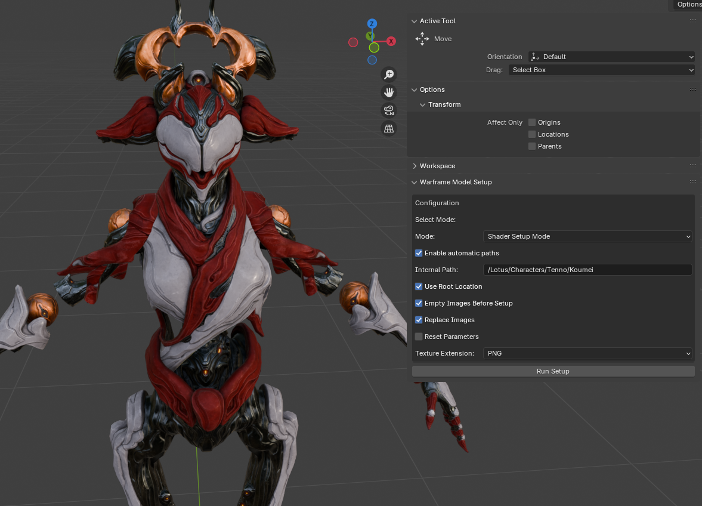

# Warframe Auto Porter Blender Addon

A Blender addon to streamline importing and configuring Warframe models/materials with proper shader setup. Works on Blender 4.1-4.4

## Features
- **Model Import**: Import GLB models with optimized settings
- **Shader Management**: Append shaders from .blend files
- **Material Setup**: Auto-configure materials using .txt material files
- **Rigging**: Character rig setup 

## Installation
1. Download latest release
2. In Blender (`Edit > Preferences > Add-ons`):
   - Click *Install from disk...* and select the downloaded file
   - Enable the "Warframe Auto Porter" addon
   - Set Preferences, if available

## Usage
Access from the right-side toolbar in 3D View (`N` panel > Tool tab).

## Modes:
- **Import Model Mode**  
   - Import GLB models with proper settings

- **Shader Append Mode**  
   - Append materials from .blend file

- **Shader Setup Mode** (Default):
   - Configure materials using material TXT file
   - Auto-link textures from either:
     - Root folder structure
     - Custom texture folder
- **Rig Setup Mode**:
   - Configure rig from .blend file

## Configuration

### Main Settings

| Property | Default | Description |
|-----------------|---------|-------------|
| **Internal Path**| `/Lotus/Objects/Duviri/Props` | Internal asset path starting with `/` |
| **Mode**| SHADER | Operation mode: - `IMPORT`: Model import - `APPEND`: Shader append - `SHADER`: Material setup |
| **Enable automatic paths**| True | Enable simplified path selection through Blender's file browser |
| **Use Root Location**| True | Use extracted folder structure instead of manually copying textures to a separate folder |

---

### Path Settings
*(Required when Enable automatic paths = False)*

| Property | Type | Example | Description |
|----------|------|---------|-------------|
| **Extracted Root Folder** | Directory | `D:/ExtractedAssets` | Parent folder containing `Lotus`, `EE`, etc |
| **Material File** | File | `D:/ExtractedAssets/Lotus/Objects/Duviri/Props/DominitiusThraxThroneA.txt` | Warframe material TXT file |
| **Model File** | File | `D:/ExtractedAssets/Lotus/Objects/Duviri/Props/DUVxThraxThrone.glb` | Model file to import (GLB format) |
| **Shader Library** | File | `D:/Downloads/PBRFillDeferred.blend` | Blend file containing shader materials |
| **Rig File** | File | `D:/Downloads/WF_Rig.blend` | Blend file containing necessary rigs and scripts |
| **Textures Folder** | Directory | `D:/Textures` | Custom folder for textures (if not using root) |

---

### Texture Settings

| Property | Default | Description |
|----------|---------|-------------|
| **Texture Extension**| PNG | Texture format from extracted files |
| **Replace Images**| True | Overwrite existing textures with new ones |
| **Empty Images Before Setup**| True | Clear existing textures before applying new |

---

### Advanced Settings
*(Use with caution)*

| Property |Default | Description |
|----------|---------|-------------|
| **Reset Parameters**| False | Force reset all values to defaults before setup|

---

## Example Setup Flow

### 1. Root-Based Material Setup (Recommended)
*For users with extracted game assets in original folder structure*

**Prerequisites:**
- Extracted game files in `/Lotus/...` structure
- Material TXT file
- Model already imported or existing in scene(either manually, or by using import mode)

**Steps:**
1. **Set Path Mode**  
   Enable *"Enable automatic paths"* 
   (Top checkbox in panel)

2. **Specify Internal Path**  
   Match Warframe's internal path from material TXT:  
   `Internal Path: /Lotus/Characters/Tenno/Koumei`

3. **Texture Format**  
   Set *Texture Extension* to match your files:  
   `*.png` for standard

4. **Run Setup**  
   With object selected: Click *Run Setup*  
   *Addon will:*  
   - Open several file viewers to complete setup for Extracter assets folder and material file txt
   - Auto-locate textures in `%Root%/Lotus/...`  
   - Configure material parameters  
   - Link all required textures

---

### 2. Custom Texture Folder Setup
*For manually organized texture libraries*

**When to Use:**  
- Modified/non-standard texture locations  
- Partial asset collections

**Configuration:**
1. Disable *Use Root Location*  
2. Set *Textures Folder* to custom location where ALL the textures from material TXT file are located:  
   `D:/MyTextures/Koumei/`  
3. Set *Material File* path:  
   `D:/MyMaterials/KoumeiMaterial.txt`  
4. Set *Texture Extension* to match files

**Execution:**  
Click *Run Setup* → Addon will:  
- Only use textures from specified folder  
- Skip root directory checks  
- Warn about missing textures in console

---

### 3. Shader Append Workflow
*For applying materials*

**Typical Use Case:**  
- Starting new material setup  
- Replacing existing materials

**Steps:**
1. **Mode Selection**  
   Change *Mode* to **APPEND**

2. **Shader Library Path**  
   Set *Shader Library* to `.blend` file location:  
   `D:/Shaders/PBRFillDeferred.blend`

3. **Append Material**  
   Click *Run Setup* → File browser appears  
   Select material matching your needs. Read README file inside .blend shader files to know which one you need.
---

### 4. Rig configuring Workflow
*For setting up rigs*

**Typical Use Case:**  
- Rigging a character using a prepared rig file

**Steps:**
1. **Mode Selection**  
   Change *Mode* to **RIGGING**

2. **Rig File Path**  
   Set *Rig File* to `.blend` file location:  
   `D:/Downloads/WF_Rig.blend`
3. **Select required objects**
   Select the body, head, cloths, other things you need using Shift + Click. Don't select any armatures, only meshes themselves. Make sure you've selected everything, even eyes of characters that have them.
4. **Append Rig**  
   Click *Run Setup* → File browser appears -> Select required file if using file viewer  
   Select rig matching your needs. Read README file inside .blend file to know which one you need. Warframes usually need Basic rig, characters with face need Face rig, etc.

---

### 4. Full Import → Material Pipeline
*Complete asset import*

1. **Stage 1 - Model Import**  
   - Set *Mode* to **IMPORT**  
   - Specify *Model File* if you don't use automatic paths 
   - Click *Run Setup* → Select the model using file viewer

2. **Stage 2 - Shader Append**  
   - Switch *Mode* to **APPEND**  
   - Run setup -> Select shader .blend file -> Choose type -> Apply

3. **Stage 3 - Material Setup**  
   - Switch *Mode* to **SHADER**  
   - Configure paths/texture format if not using automatic paths
   - Click *Run Setup* -> Select material file and Extracted Root Folder if using automatic paths
   - 
4. **Stage 4 - Rig Setup**  
   - Switch *Mode* to **RIGGING**  
   - Configure path if not using automatic paths
   - Click *Run Setup* -> Select rig file if using automatic paths -> Select rig to append

---
## Troubleshooting
- **Missing Textures**: Verify paths in material TXT file match texture locations
- **Material Issues**: Double-check shader parameters in TXT file
- **Rig issues**: Double check you've selected required objects, read list of known issues, make sure you're setting up 1 character per blend file.
- **Something else**: Check Console (`Window > Toggle System Console`) for details

## Support
For issues/bugs:  
[Open GitHub Issue](https://github.com/BellSharions/Warframe-Auto-Porter-Addon/issues)  
*Include:* Blender version, error logs, and sample files if possible